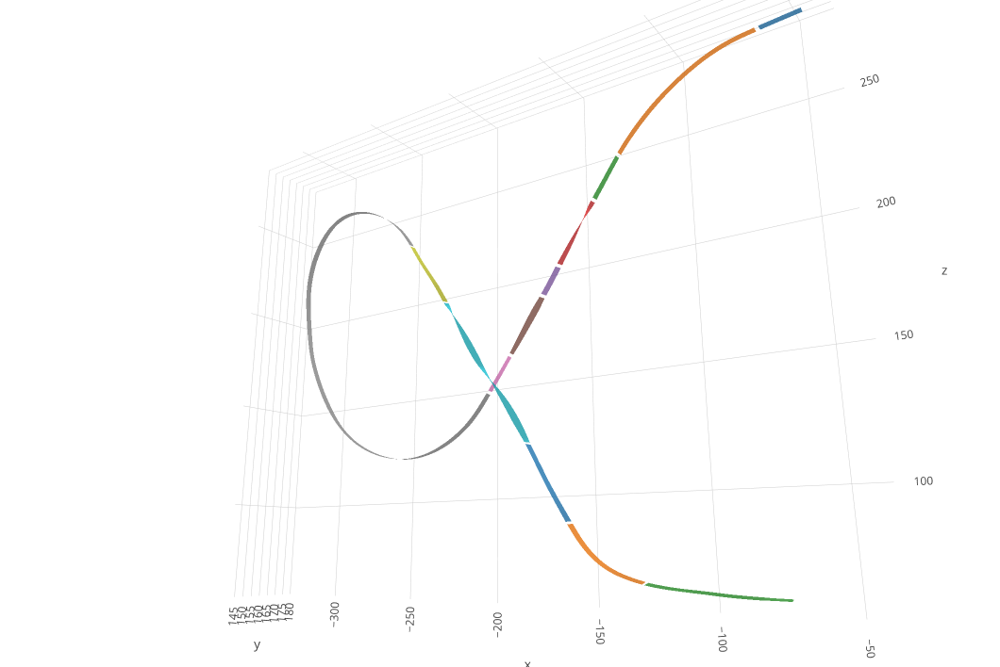
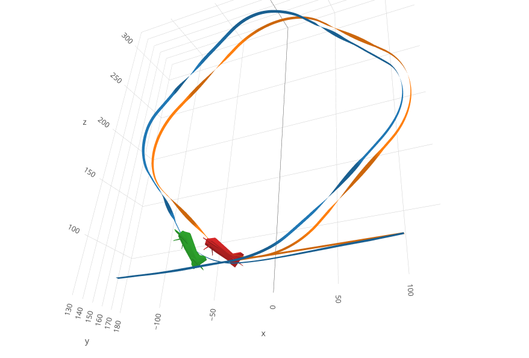

## Flight Data Analysis Tools

This project contains a collection of packages for working with flight data, mostly aimed at plotting and analysing precision aerobatics, but many of the tools are useful for other applications. The project was the inspiration for Flight Coach, a web app that brings aerobatic flight plotting functionality to a wider audience: https://www.flightcoach.org/.

The following packages are included:
- **schemas** - Pydantic schemas used py the PyFlightCoach packages
- **ardupilot-log-reader** - a wrapper round pymavlink to read an Ardupilot bin file
- **pfc-geometry** - Tools for handling 3D geometry. contains classes that wrap around a point, quaternion, coordinate frame etc. 
- **flightdata** - Datastructures for handling flight data
- **flightplotting** - Handy tools for creating plotly plots of the flightdata objects.
- **droneinterface** - A tidy way to communicate with a UAV using pymavlink and the pyflightcoach tools. 




### Install from pypi
pip install the packages you want to use inside a virtual environment with python >=3.12.
```bash
pip install ardupilot-log-reader
pip install pfc-geometry
pip install flightdata
pip install flightplotting
pip install droneinterface
```

### Cloning
When cloning use the --recurse-submodules option:
```bash
git clone --recurse-submodules https://github.com/PyFlightCoach/PyFlightCoach.git
```
If you forget to use the --recurse-submodules option then do this:
```bash
cd PyFlightCoach
git submodule init
git submodule update
```
### Easy setup (with conda):
Install conda as described here: https://docs.anaconda.com/free/miniconda/miniconda-install/

Then:

```bash
sh setup.sh
```

### To setup manually
In a virtual environment with python >= 3.12, then cd to each submodule and do: 
```bash
pip install -e . --config-settings editable_mode=compat
```

## Docker

Build the docker image:
```bash
docker build -t pyf .
docker run --rm -it pyf /bin/bash
```

get the latest released image from docker hub:
```bash
docker pull thomasdavid/pyflightcoach
```